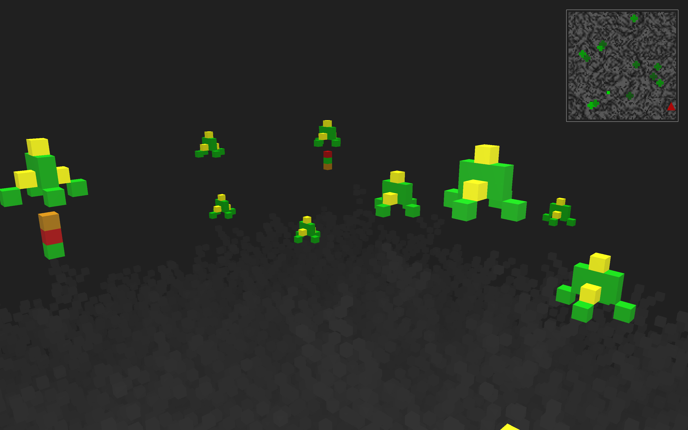

# Defender

A 3D game programmed in C and C++ using OpenGL. Based loosely on the classic [defender video game](https://en.wikipedia.org/wiki/Defender_(1981_video_game)). A class project for CIS4820 at the University of Guelph.

# Gameplay

Aliens swarm and attemp to capture humans. Shoot them before they do. Move using WADS and mouse for movement. Press space to fire. 

# Engine Debugging

- Press `r` to reset and restart game
- Press `o` to toggle an oblique view to better observe collisions (player position is marked with a blue cube)
- Press `t` to toggle traction mode which reduces player drift
- Press `p` to toggle pausing unit movement
- Press `u` to toggle unlocking timer-based movement speed

Additionally see include/definition.h to tweak game parameters as desired.

# Running

- Run `cmake . && make` to build
- Run `./defender` to play	
